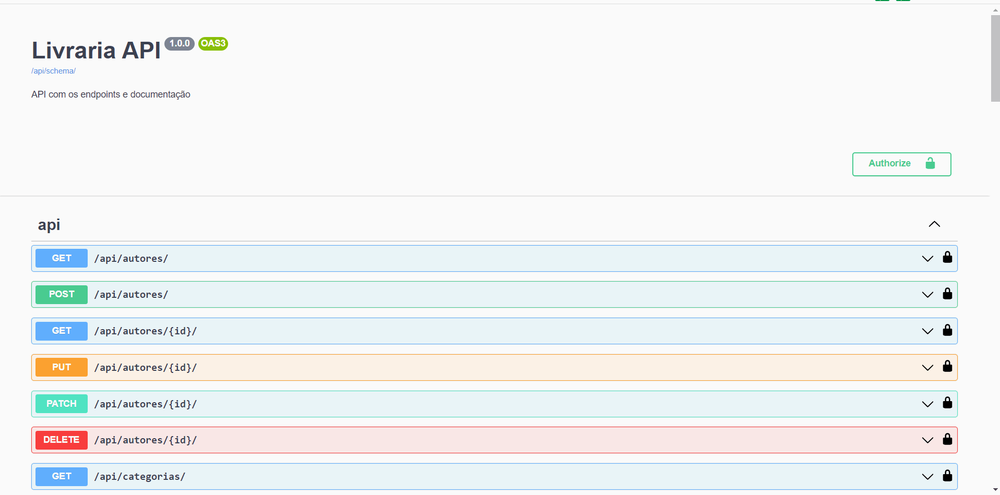

<h1>Example Fast API</h1> 

  
  
  

> Status do Projeto: concluído

### Tópicos 

:small_blue_diamond: [Descrição do projeto](#descrição-do-projeto)

:small_blue_diamond: [Funcionalidades](#funcionalidades)

:small_blue_diamond: [API](#API)

:small_blue_diamond: [Pré-requisitos](#pré-requisitos)

:small_blue_diamond: [Como-executar](#como-executar)

:small_blue_diamond: [Desenvolvedora](#Desenvolvedora)

## Descrição do projeto 

  Projeto criado para entender e praticar entidades relacionadas com DRF

## Funcionalidades

:heavy_check_mark: CRUD de Autores 

:heavy_check_mark: CRUD de Categorias 

:heavy_check_mark: CRUD de Editores

:heavy_check_mark: CRUD de Livros 

:heavy_check_mark: CRUD de Compras

## API

## Pré-requisitos
Todas as dependencias estão listadas no arquivo requirement.txt e podem ser baixadas com o comando: pip install -r requirements.txt

:warning: [Django](https://docs.djangoproject.com/)

:warning: [Django Rest Framework](https://www.django-rest-framework.org/topics/documenting-your-api/)

:warning: [DRF Spetacular](https://drf-spectacular.readthedocs.io/en/latest/)

## Como-executar:

Para rodar o exemplo, siga os passos:

1 - Baixe o projeto localmente (git clone)

2 - Crie o virtual env dentro da pasta do projeto (virtualenv venv)

3 - Ative o venv (Windows: venv\Scripts\activate)
 
4 - Instale as dependencias (pip install -r requirements.txt)

5 - Execute o servidor local (python manage.py runserver)

6 - Acesse a url do swagger: http://localhost:8000/api/swagger/

## Desenvolvedora :

| [ Mayara Madeira Trevisol](https://github.com/mayara-mt) | 
|:--------------------------------------------------------------------------------------------------------------------------------------------------------------------------------------------------:|  